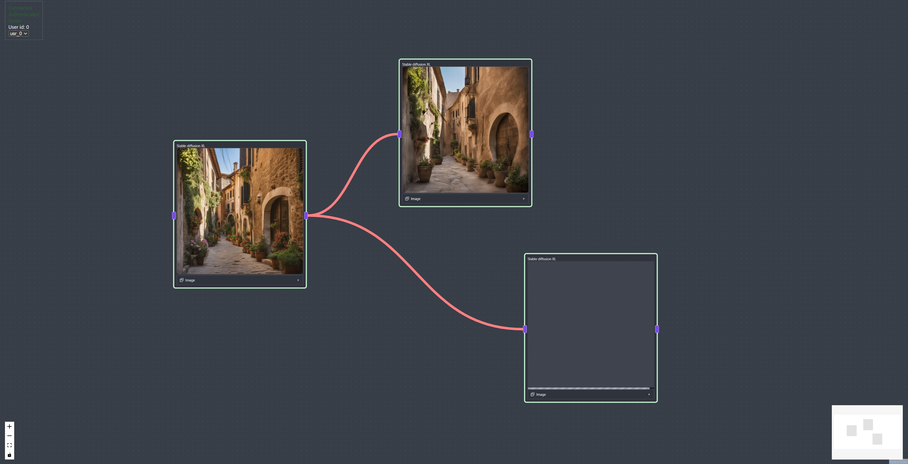

# web_Sd

Interfejs graficzny to korzystania z generatywnych modeli sztucznej inteligencji

Plan działania:

- [x] dodanie screana jak to wygląda
- [x] uwspólnienie typów dla tsa
- [ ] stworzenie którkiego opisu aplikacji
- [ ] dodanie części pythonowej 
- [ ] opisanie części pythonowej
- [ ] stworzenie grafu połączeń między serwisami na ilustracji
- [ ] pomyślenie nad następnymi krokami

    