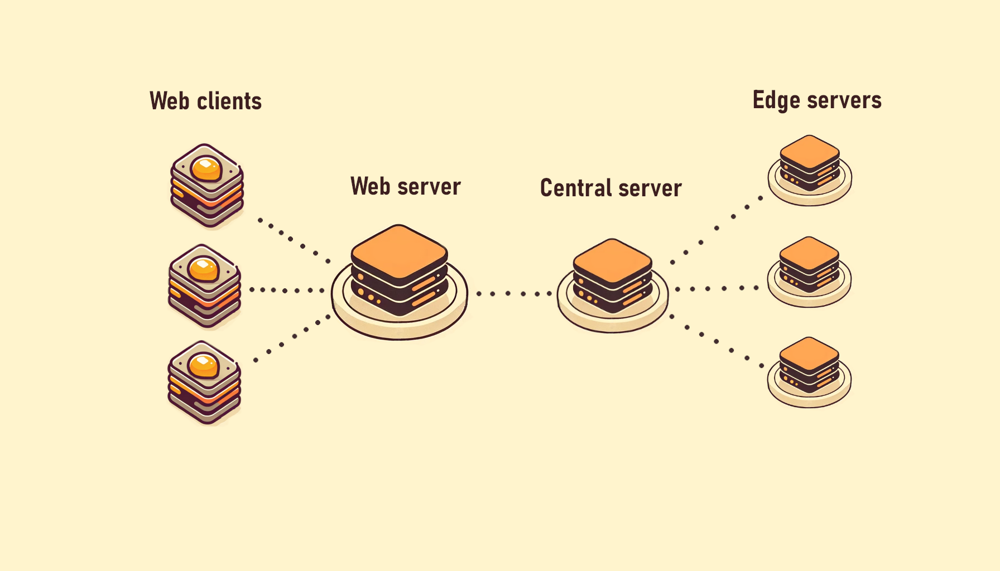

# web_sd

## Opis ogólny

Interfejs graficzny typu "mapa myśli" do kreatywnego korzystania z graficznych generatywnych modeli sztucznej inteligencji.
Dalszy rozwój projektu ma na celu stworzenie intuicyjnego interfejsu do korzystania z różnych modeli generatywnych.
Całość oparta na na mikroserwisach, w celu ułatwienia późniejszych "permutacji" w architekturze. 

## Architektura

Aktulanie całość można podzielić na dwie części, pierwsza związana jest z aplikacją webową, druga z obsługą modeli lub/i api w backendzie.



### Aplikacja webowa

Aplikacja webowa pozwala na współpracę wielu osób w czasie rzeczywistym w jednej przestrzeni, gdzie każdy jest w stanie obserwować zmiany pozostałych urzytkowników. Zadania generacji z backendu aplikacji przekazywane są do serwera centralnego, który kolejkuje je, a następnie przekazuje do serwerów edgowych. Ilość serwerów edgowych jest skalowalna


### Ai backend

Serwer centralny aplikacji w tym momencie jest nastawiany na komunikację z jednym klientem. Akutalnie jego tryb działania jest nastawiony na rozsyłanie rządzań interfejsu webowego tj. zapytania txt2img, img2img i inpaint (choć sam interfejs jeszcze tego nie obsługuje) oraz na odsyłanie wyników przetwarzania wraz z informacjami o procesie przetwarzania, bezpośrednio od serverów przetwarzających. 
Serwery przetwarzając implementyją wspomniane wcześniej funkcje stable diffusion, opierają się one bibliotrkę diffusers w sposób, który tylko raz ładuje model a potem dystrybyuje go po różnych pipelinach biblioteki.

## Instrukcje

### Wymagania windows/linux (python)

anaconda

### Konfiguracja środowiskaa (windows powershell)

```
cd web_sd
conda create -n web_sd_env python=3.10 (jeśli środowisko nie zostało wcześniej stworzone)
conda activate web_sd_env
pip install -r req.oai.txt (lub req.oai.txt)

```

### Uruchamianie aplikacji (windows powershell)


```
cd web_sd
./_activate.ps1
./_run_edge.ps1 / ./_run_central.ps1

```
---
### EEG related

- zainstalować sobie [conda](https://www.anaconda.com/download/)
- zainstalować sobie [git](https://git-scm.com/download/win)
- zachęcam też do instalacji [vscode](https://code.visualstudio.com/)
- następnie uruchomić powershell
```
conda init
```
- zamknąć i na nowo uruchomić powershell, sprawdzić czy na początku linijki pojawiło się (base)
- aktywacja środowiska:
```
cd web_sd
# za pierwszym razem globalnie, nie wiem jak się zachowa bo nie testowałem,
# ale powinno zadziałać
./_create_env.ps1
# za pierwszym razem jak siadasz do uruchomienia serwera
./_activate.ps1
# uruchomienie serwera
python ./src/serv/eeg_brocker/main.py 4444
```
- czasami serwer trzeba będzie zatrzymywać, bo się coś zwiesi po stronie blendra, serwer zatrzymujesz Ctrl+c
